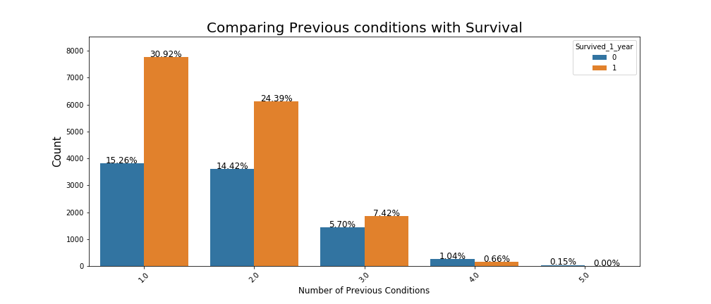
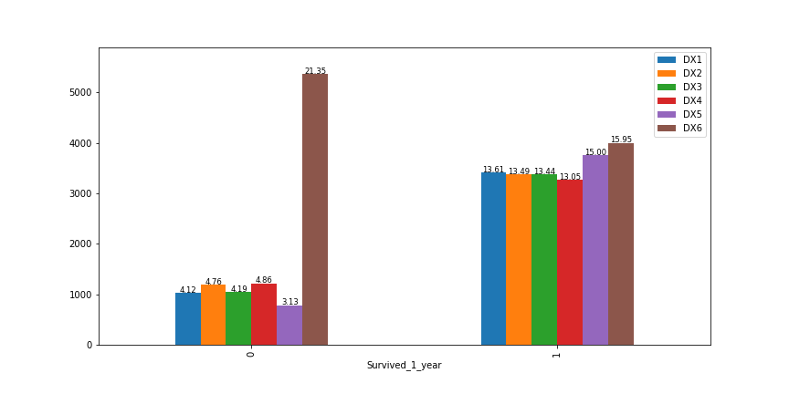

# patient_survival_prediction
Developing a model that will predict the chances of survival of a patient.

This is an assignment given at DPhi bootcamp.

# Objective
A hospital in the province of Greenland has been trying to improve its care conditions by looking at historic survival of the patients. They tried looking at their data but could not identify the main factors leading to high survivals.

You are the best data scientist in Greenland and they've hired you to solve this problem. Now you are responsible for developing a model that will predict the chances of survival of a patient after 1 year of treatment (Survived_1_year).

# Data Description
The dataset contains the patient records collected from a hospital in Greenland.

The "Survived_1_year" column is a target variable which has binary entries (0 or 1).

Survived_1_year == 0, implies that the patient did not survive after 1 year of treatment Survived_1_year == 1, implies that the patient survived after 1 year of treatment

Features:

1. ID_Patient_Care_Situation: Care situation of a patient during treatment

2. Diagnosed_Condition: The diagnosed condition of the patient

3. ID_Patient: Patient identifier number

4. Treatment_with_drugs: Class of drugs used during treatment

5. Survived_1_year: If the patient survived after one year (0 means did not survive; 1 means survived)

6. Patient_Age: Age of the patient

7. Patient_Body_Mass_Index: A calculated value based on the patient’s weight, height, etc.

8. Patient_Smoker: If the patient was a smoker or not

9. Patient_Rural_Urban: If the patient stayed in Rural or Urban part of the country

10. Previous_Condition: Condition of the patient before the start of the treatment (This variable is splitted into 8 columns - A, B, C, D, E, F, Z and Number_of_prev_cond. A, B, C, D, E, F and Z are the previous conditions of the patient. Suppose for one patient, if the entry in column A is 1, it means that the previous condition of the patient was A. If the patient didn't have that condition, it is 0 and same for other conditions. If a patient has previous condition as A and C , columns A and C will have entries as 1 and 1 respectively while the other column B, D, E, F, Z will have entries 0, 0, 0, 0, 0 respectively. The column Number_of_prev_cond will have entry as 2 i.e. 1 + 0 + 1 + 0 + 0 + 0 + 0 + 0 = 2 in this case.).

# Conclusion

After spending hours on cleaning the data and then doing some data analysis, we created various classification models.

The XGBoost model is the best performing model. The F1 score improves after hyper parameter tunning the model. The F1 Score of 87.67 is a very good score. The model yet misclassifies alot so it cannot be taken into the production phase. We have to improve the F1 score further by various advanced classification techniques.

Yet the Exploratory data analysis has given us good insights that could actually help increase the survival chances of the patients.

Those insights are:

   1. Controlling the BMI by keeping it in between 19 and 26.
   2. Reducing the smoking habits of the patients.
   3. Being extra cautious with patients with condition 'A'.
   4. Finding alternatives to the 'DX6' drug.
   
 
 
 Further the misclassifications can be controlled more to put forth this model into production.
